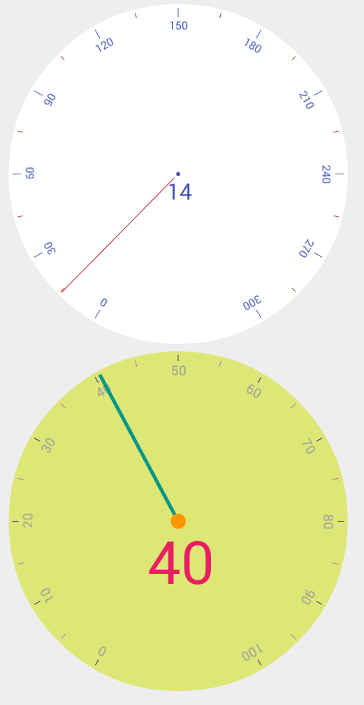

# MeterView
MeterView for Android

##Usage

###Adding Library

you just add the following dependency to your build.gradle:

```groovy 
 dependencies {  
    repositories {
        mavenCentral()
    }
    compile 'com.anwios.meterview.view:meterview:1.0.0'
  }
```

### example codes
```xml 
 <com.anwios.meterview.view.MeterView
        android:id="@+id/mv"
        android:layout_width="wrap_content"
        android:layout_height="0dp"
        android:layout_weight="1"
        app:mv_value="14.6"/>
```

```xml 

<com.anwios.meterview.view.MeterView
        android:id="@+id/mv2"
        android:layout_width="wrap_content"
        android:layout_height="0dp"
        android:layout_weight="1"
        android:layout_marginTop="8dp"
        app:mv_backgroundColor="#DCE775"
        app:mv_centerPointColor="#FF9800"
        app:mv_centerPointSize="8dp"
        app:mv_headColor="#009688"
        app:mv_headWidth="4dp"
        app:mv_markerBigColor="#4A148C"
        app:mv_markerBigSzie="7dp"
        app:mv_markerSmallColor="#BA68C8"
        app:mv_markerSmallSzie="7dp"
        app:mv_markerTextColor="#9E9E9E"
        app:mv_markerTextSzie="14sp"
        app:mv_maxValue="100"
        app:mv_minValue="0"
        app:mv_textColor="#E91E63"
        app:mv_textSize="64sp"
        app:mv_value="40.6" />
```

 sample
 
 
## Contributions

Any contributions are welcome. 

## Developed By
* Nooh - <nooh64@gmail.com>

## License
This projected is licensed under the terms of the MIT license.
